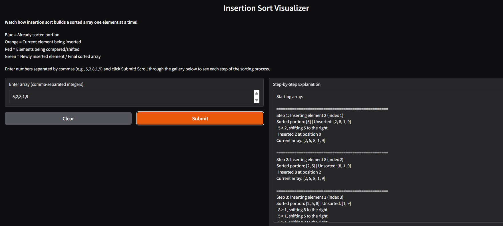
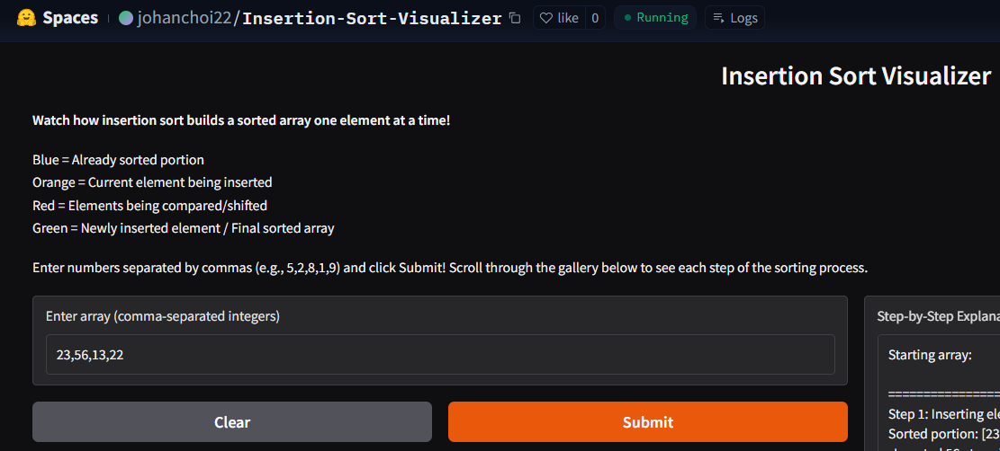
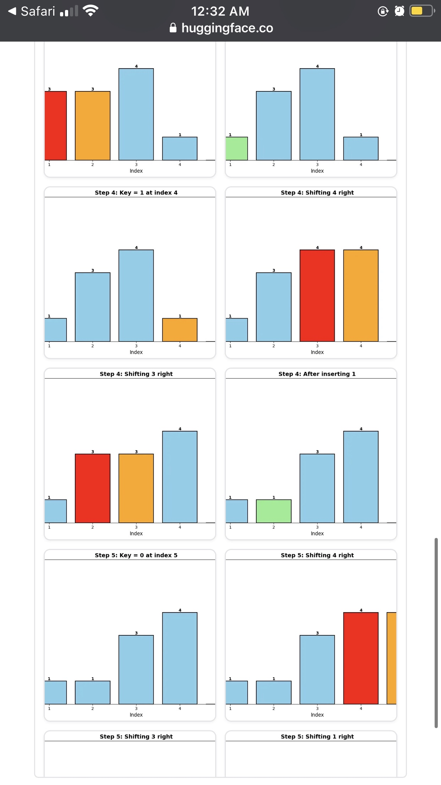
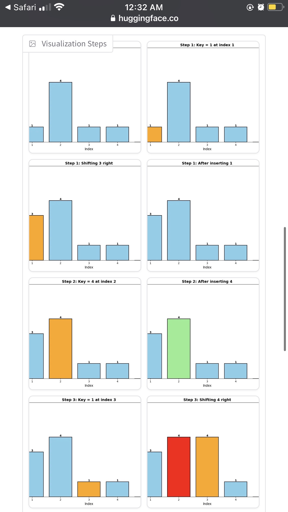
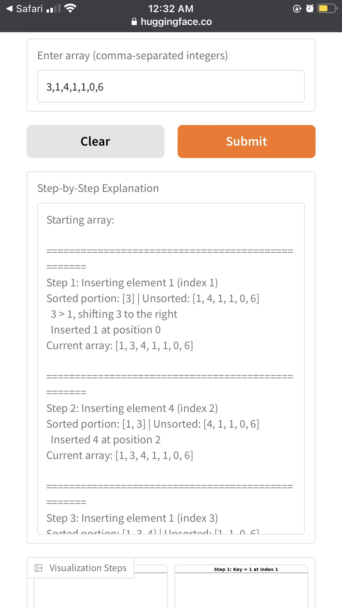

# CISC121_Final_Project
Take inputs and display subsequent logic and step-by-step proccess of insertion sort

Algorithm Chosen:
Insertion Sort; {Reason} As a personal project, I want to create an application that creates a schedule or “To do-list” by taking user inputs for events and urgency and sorting them based on priority. While there are many ways to sort data, and namely, more efficient ways to sort data, I believe that insertion sort is the best fit for this application as it will be dealing with relatively small data sets, and maintaining the relative order of identical “priority” levels while sorting would be important. 

Test cases:

Computational Thinking:
Decomposition - Input → {Recusively} → Divide list into pieces → Compare pieces and adjust positions → Repeat → Display final result

Graphical implementation - After dividing list into pieces create bar chart using current order and values → After each recursion, update the image

Steps to run: 
Input list of integers separated by commas

Hugging Face link:
https://huggingface.co/spaces/johanchoi22/Insertion-Sort-Visualizer 

Author and A.I acknowledgements:
Used google search to find a base case of insertion sort; https://www.geeksforgeeks.org/dsa/insertion-sort-algorithm/ 
Used suggestions from Claude AI to properly integrate features from Gradio and Hugging Face. 
Used Suggestions from Claude AI to clean up display and formatting, eg colour coded bar graphs, improved user instructions

